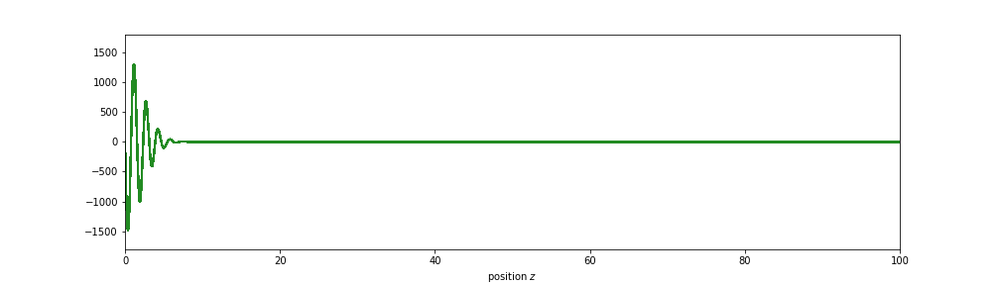
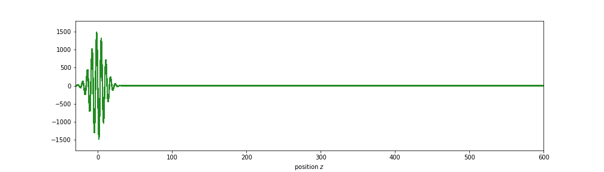

# pulse_simulation
Simple python code to visualise the construction and the propagation of light pulses.
The code uses a method that aims be a good approximation to the fourier transformation.

You start with defining a frequency spectrum of the pulse you want to visualise.
Afterwards, the code constructs the spectral components of the pulse according
to the frequency spectrum you defined. This means that the final pulse is the 
sum of all the spectral components. The spectral components are just sinusoidal
waves with the corresponding frequency. In order to visualise the propagation 
of such a pulse, the wave vector `k` is calculated as a function of the
frequency `k(ν)`. 

    k(ν) = k(ν0) + k'(ν0) * (ν - ν0) + 1 / 2 * k''(ν0) * (ν - ν0) **2 + ...

This allows to visualise different effects that occur when
propagating the pulse along a z-axis.

## Group delay

One example is the group delay, which means that the first derivative `k'(ν0)`
is non-zero. Assuming that all higher order derivatives vanish, the resulting
propagation look like this:

## Group velocity dispersion

If also the second derivative is non-zero, then group velocity dispersion
occurs, resulting in a linear frequency chirp of the pulse:

