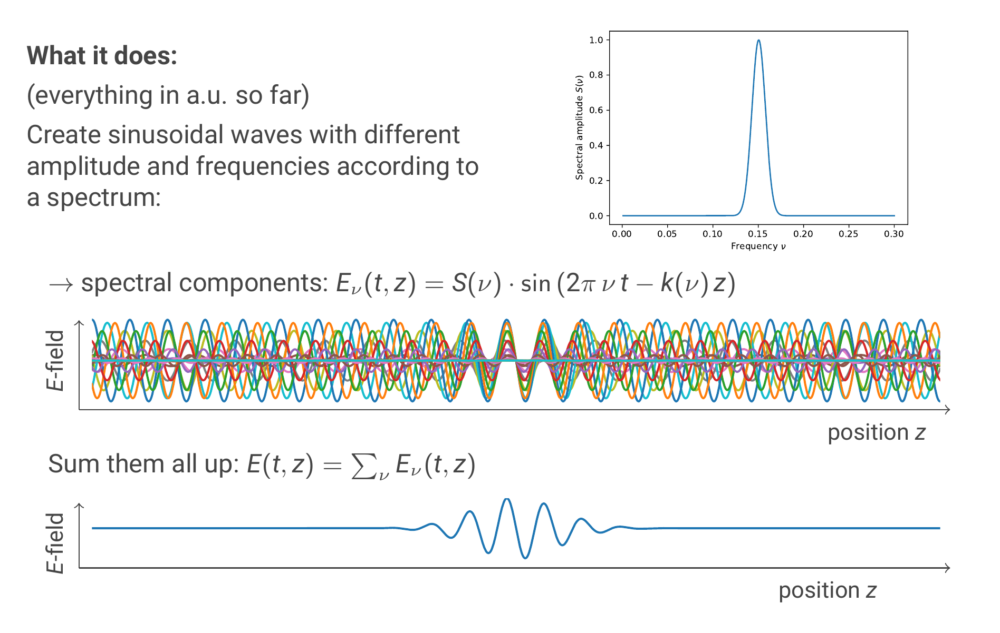
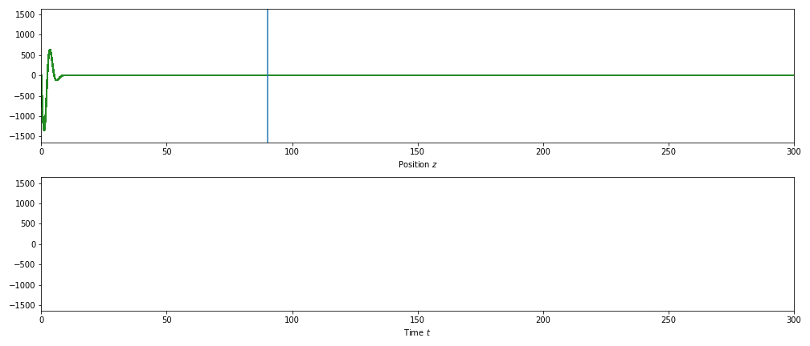

# Examples

You start with defining a frequency spectrum of the pulse you want to visualise.
Afterwards, the code constructs the spectral components of the pulse according
to the frequency spectrum you defined. This means that the final pulse is the
sum of all the spectral components. The spectral components are just sinusoidal
waves with the corresponding frequency. In order to visualise the propagation
of such a pulse, the wave vector `k` is calculated as a function of the
frequency `k(ν)`.

    k(ν) = k(ν0) + k'(ν0) * (ν - ν0) + 1 / 2 * k''(ν0) * (ν - ν0) **2 + ...

The function is constructed as the Taylor expansion around the centre
frequency `ν0`.



This allows to visualise different effects that occur when
propagating the pulse along a z-axis.

## Phase velocity and group velocity

If the refractive index is the same for all frequencies, then the wave vector
`k(ν)` has to fulfill the equations

    k(ν0) = k'(ν0) * ν0 ,  k'(ν0) = n / c_0

where `n` is the refractive index and `c_0` the speed of light in vacuum. The
resulting propagation looks like this

```py
§§§examples/group_equal_phase.py§§§
```


which means that phase velocity and group velocity are the same here.

If `k(ν0)` and `k'(ν0)` do not fulfil the conditions as in the above
example, the phase velocity and the group velocity differ.
Assuming that all higher order derivatives vanish, the resulting
propagation looks like this:

```py
§§§examples/first_order_dispersion.py§§§
```


## Group delay

Group delay in general is the derivative `dφ/dω`. In physical terms, the group
delay is the time it take for a spectral component to propagate through the
system you are looking at. Therefore, if the different spectral components
propagate at different velocities like in an optical fibre, the group delay
changes with the frequency.
Since the phase is `φ(ω) = k(ω) * z`, we get for the group delay

    T(ω) = dφ/dω = z * 2 * π * ( k'(ν0) + k''(ν0) * (ν - ν0) + ... )

The different orders here are the different orders of dispersion.
Zeroth order dispersion basically means that the group velocity differs from
the phase velocity (the case in the previous animation).

## Group velocity dispersion

If also the second order dispersion is non-zero, then group
velocity dispersion (GVD) occurs, resulting in a linear frequency chirp
of the pulse:

```py
§§§examples/second_order_dispersion.py§§§
```


## Spatial representation vs. time representation

As can be seen in the animation above, when having GVD the pulse become
asymmetrical along the z-axis. However, this is not the case when looking at the
electric field at one fixed position as a function of time.
This is shown in the animation below. The upper animation shows the propagation
of the pulse along the z-axis, while the lower animation shows the electric
field of the pulse at the position which is marked in the upper animation with
the vertical line as a function of time.

In the time domain (at a fixed position), the pulse still has a Gaussian shape,
since only the spectral phases are changed, but not the amplitudes, which means
that the spectral distribution is still a Gaussian, and therefore also the
pulse in time is a Gaussian.


